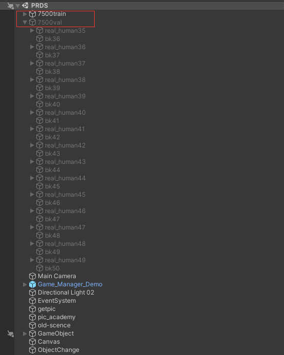
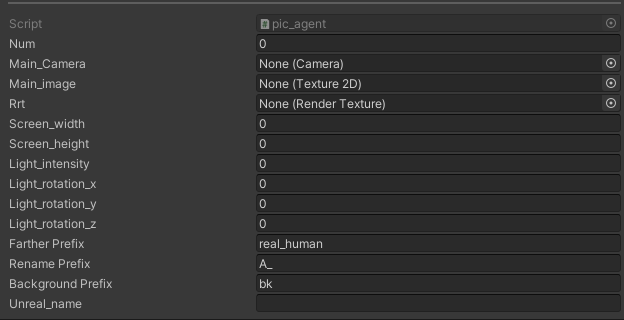
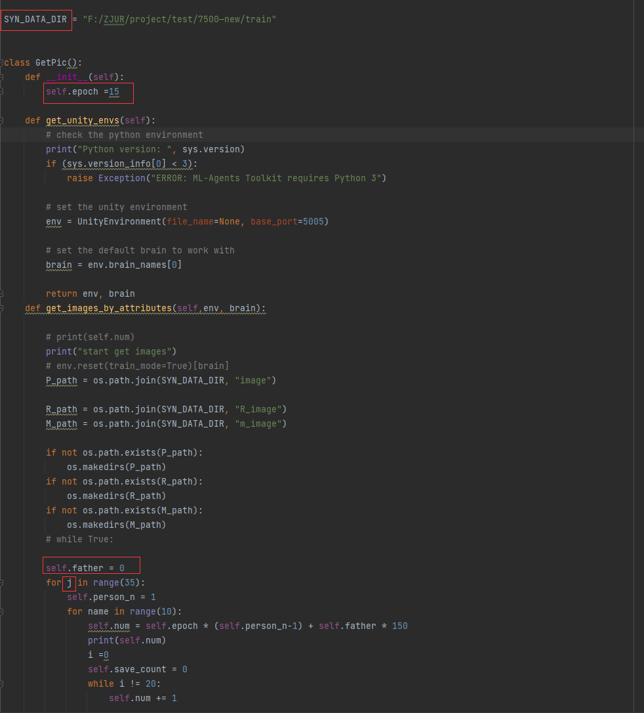
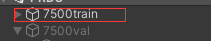
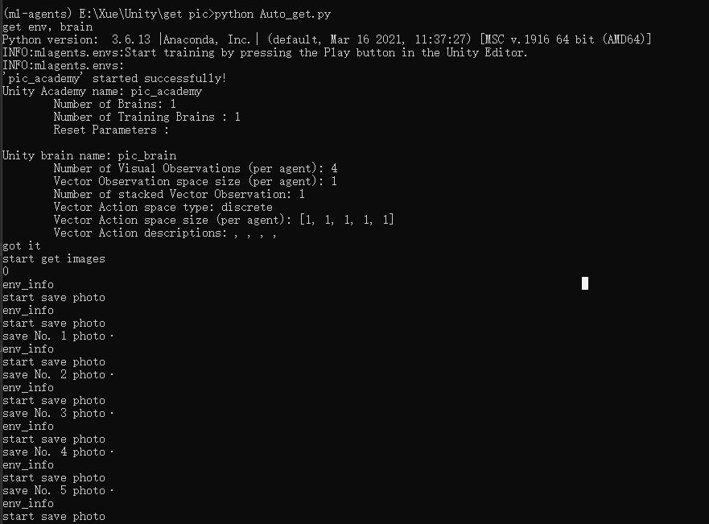

# Readme

# **Instructions of the System**

- This system utilizes `ML-agents` to experiment with the interaction between `Python` and `Unity`, enabling the fully automated generation of all-angle lighting datasets, as well as the manual creation of fixed lighting datasets with character removal.
- The version of Unity used in this work is `2019.4.38.f1 personal` that can be downloaded from the [Unity Website](https://unity3d.com/)

# Preparation

- python(In this project, the version is 3.6)
- ML-agents (In this project, the version is 0.10.0.)
- Unity == 2019.4.38.f1 personal

## Project

Please use Baidu Netdisk to download the Unity project. Once downloaded, you can open it directly with Unity. [Download link](https://pan.baidu.com/s/1eb6Xqyn5PCImd-3uhVV90Q?pwd=qcsd
)

## Make the Dataset（full light dataset）

1. download the project and `Auto_get.py`

2. open the project in `unity`

3. Here, two objects are set up: one for configuring the character and background images for the training set, and the other for the validation set, which are `7500val` and `7500train` respectively.
   
    
    
4. In the getpic plugin, Farther Prefix, Rename Prefix, Unreal_name, and Background Prefix are customizable. If you need to train your own model, you can modify these names. Specifically, Farther Prefix stores the prefix names representing the parent objects that contain all character models, such as real_human0; Rename Prefix serves as the name prefix for the 3D reconstructed character models as child objects; Unreal_name represents the name prefix for the handcrafted character models as child objects; Background Prefix indicates the parent objects that store the background images. Before creating the dataset, you need to place the character models and background images into the corresponding objects and arrange their positions in space in advance. You can use the main camera lens to adjust the placement of characters and images.
   
    
    
5. Next, let's introduce some parameter settings in the Python code: SYN_DATA_DIR is the path where the dataset is stored. The parameter `epoch` represents the number of lighting angles to be adjusted, which is set to 15 in this case, meaning 15 different lighting angles will be randomly generated. The parameter `father` indicates from which scene to start creating, while `j` can represent how many scenes' content will be generated this time. For example, in this dataset, there are a total of 50 scenes, which is equivalent to 50 background images. The training set and validation set are divided in a ratio of 7:3. Therefore, 35 scenes are used as the training set, and 15 scenes are used for the validation set. When creating the training set, you need to set `father` to 0 and `j` to 35. Similarly, when starting to create the validation set from the 36th scene, you need to set `father` to 35 and `j` to 15. There is no need to change other parameters.
   
    
    
6. After all the parameters are set, first ensure that the objects corresponding to the dataset to be generated are active in Unity. For example, if you want to generate the training set, first activate the `7500train`  object (highlighted), and its child objects can remain inactive.
   
    
    
7. First, run the `Auto_get.py` script in the ml-agents environment, and then quickly click the `play`button in Unity. When the following output appears, it indicates that the operation was successful.
   
    
    
    
    
    
